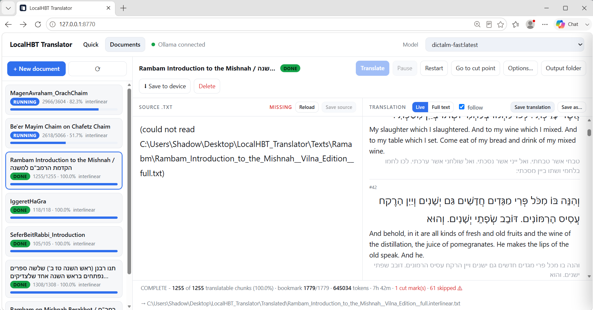

# LocalHBT Translator

A local Hebrew ⇄ English translator with a proper GUI, running entirely offline
against Ollama on your own GPU. No API keys, no cloud, no data leaving the machine.

## Run it

Double-click **`Run Translator.bat`**.

It starts a small local server and opens <http://127.0.0.1:8770> in your browser.
Close the console window to stop it.

## Why a browser window instead of a terminal

Hebrew looked reversed in the terminal because Windows consoles don't implement
the Unicode Bidi Algorithm — the text was always stored correctly, it was only
*displayed* backwards. Browsers implement bidi properly, so the same text renders
right-to-left the way it should, with nikud attached to the correct letters and
embedded English/numbers in the right place.

Both text panes use `dir="auto"`, so each pane detects its own direction from the
text you put in it. Hebrew goes RTL, English goes LTR, automatically.

## Using it

| Control | What it does |
|---|---|
| **⇄** | Swap direction (He→En / En→He). Moves a finished translation into the source box for round-tripping. |
| **Natural** | Fluent, idiomatic output. Default. |
| **Literal** | Stays close to original wording and structure. Better for Torah / source texts. |
| **thinking** | Lets the model reason before answering. Slower. Off by default. |
| **Model** | Any model installed in Ollama. Defaults to `dictalm-fast`. |
| **Copy result** | Copies just the translation, not the reasoning. |

Shortcuts: `Ctrl+Enter` translate · `Ctrl+Shift+S` swap · **Stop** cancels mid-stream.

The footer shows live tok/s, time-to-first-token, and total time for each run.

### "Model reasoning" box

DictaLM 3.0 is a *Thinking* model and sometimes emits its reasoning chain inline
even when thinking is switched off. The UI detects this and moves that text into
a collapsed **Model reasoning** box, keeping only the translation in the main
pane. On a Genesis 1:1 test, 543 of 644 characters were reasoning — you don't
want that in your output. Open the box if you ever want to see it.

---

# Documents tab — translating whole files

The **Quick** tab above is the paste box. The **Documents** tab feeds a whole
`.txt` in, translates it chunk by chunk in the background, and survives being
interrupted.

## The job file

Every document you translate gets its own JSON in **`Translations\`**, named after
the source file. It is the single source of truth and is rewritten *after every
chunk*, so a crash costs at most one chunk. Open one in Notepad and the top of the
file tells you where things stand:

```json
"status": "interrupted",
"status_line": "CUT OFF MID-TRANSLATION - 2 of 468 translatable chunks (0.4%)",
"percent": 0.4,
"bookmark": 12,
```

Below that sit the settings, then every chunk with its source line, its vocalized
Hebrew, its translation and any warning. Deleting a job's JSON only forgets the
progress — the source `.txt` and anything already written out are left alone.

The translated `.txt` goes to **`Translated\`** by default, or wherever you point
**Save output to**. It is rebuilt from the JSON after every chunk, so it is always
a clean prefix of the finished document — never a file with holes in it.

## Interlinear mode

Pick **Interlinear** when creating a document. The text is cut into lines of
**16–17 Hebrew words** (a 17th word is pulled in when it finishes the clause
rather than stranding it), and each line comes back vocalized with **nikkud**,
with its English directly underneath:

```
שְׁמַע יִשְׂרָאֵל ה' אֱלֹהֵינוּ ה' אֶחָד. בָּרוּךְ שֵׁם כְּבוֹד מַלְכוּתוֹ לְעוֹלָם וָעֶד.
Hear, O Israel: The Lord our God, the Lord is one. Blessed be the name of His
glorious kingdom for ever and ever.
```

Words per line is adjustable, and nikkud can be switched off. When the vocalized
line comes back with a different word count than the source, or with no nikkud at
all, that chunk is flagged **⚠** in the Live pane so you can eyeball it.

## What gets translated, and what gets copied

A line is sent to the model only when **most of its letters** are in the language
you are translating from (40% by default, `HBT_MIN_SRC_RATIO`). Everything else —
rules, section markers, Sefaria's header block, blank lines — is copied to the
output untouched and never costs a model call.

The looser rule ("contains one Hebrew letter") was a trap. A Sefaria title line
like `Rambam Introduction to the Mishnah  /  הקדמת הרמב"ם למשנה` is two thirds
English, and asking a model to vocalize *and* translate that ambiguous a line can
send it into a repetition loop. Now it passes straight through. A genuinely Hebrew
line containing an English word or clause still gets translated.

## When the model loops

Thinking models sometimes get stuck repeating themselves instead of answering. A
chunk is one short line, so thousands of characters with no answer in sight means
something has gone wrong. After 6,000 characters (`HBT_RUNAWAY_CHARS`) that chunk
is cut loose: it is flagged **⚠ skipped** with the reason, its translation is left
blank for you to fill in by hand, the footer shows a **skipped ⚠** count, and the
document carries on. One bad line can no longer stall the whole job.

While the model is thinking, the Live pane shows only the **last 240 characters**
of its reasoning, in grey, with a running character count. A model going in
circles then reads as one repeated line rather than a wall of text.

## Bookmark, cut-off and resume

The job's `bookmark` is the index of the next chunk to translate. Everything hangs
off it:

- **Pull the plug mid-translation.** The JSON is left saying `running`. Next time
  the server starts it notices, flips the job to **CUT OFF MID-TRANSLATION**, and
  records a cut mark.
- **Press Translate.** The button reads **Resume from 7** and picks up at the
  bookmark. Nothing already translated is re-run.
- **The visual cue.** Wherever a run stopped early, three blank lines are pushed
  into the *source* `.txt` at that exact spot. Scroll the old text and the gap
  shows you by eye where it left off. Marking the same spot twice does nothing,
  and the marks are found by content, so earlier marks never throw later ones off.
  Switch it off per document with **mark cut points in the source file**.
- **Go to cut point** scrolls the source pane there and selects the line.

Resuming always uses the bookmark, never the blank lines — so editing the source
around a mark cannot confuse it.

## Editing

Both panes are editable while the job runs.

- **Source** — edit and **Save source** writes back to the `.txt`. If the text no
  longer matches what the job was built from, the pane says so; **Restart**
  re-reads and re-chunks it.
- **Translation / Live** — every Hebrew and English line is editable in place.
  Click out and the chunk is saved to the JSON and the output `.txt` is rebuilt.
- **Full text** — the whole translation in one box; edit it and **Save translation**
  writes the lot. **Save as…** sends it anywhere else.

## Buttons

| Button | What it does |
|---|---|
| **+ New document** | Pick a `.txt`, choose the layout and options, create the job |
| **Browse…** | Server-side file browser. Uses the file where it sits — cut marks go in *your* file |
| **From computer…** | The normal Windows file dialog. Browsers hide real paths, so the file is **copied** into `Texts\Uploads\` and the copy is translated |
| **Translate / Resume from N** | Start, or continue from the bookmark |
| **Pause** | Stops after the current chunk and marks the cut point |
| **Restart** | Re-reads the source, re-chunks, starts from the top |
| **Go to cut point** | Jumps the source pane to where it stopped |
| **Options…** | Model, style, output folder, nikkud, cut marks — mid-job |
| **Output folder** | Opens `Translated\` in Explorer |
| **Delete** | Removes the job JSON only |
| **Live / Full text** | Chunk-by-chunk view as it fills in, or the whole document |
| **follow** | Auto-scroll to the newest chunk |
| **Save source / Save translation / Save as…** | Write the panes back to disk |

## A note on speed

DictaLM is a Thinking model and reasons before each chunk even with thinking off,
so a long document is an hours-long background job, not a coffee break. That is
exactly what the bookmark is for: start it, close the lid, resume tomorrow. The
footer shows a running estimate of time left. A shorter, non-thinking model in the
**Model** dropdown will be far quicker if you don't need the quality.

## Speed

The model is `dictalm-fast` — DictaLM-3.0-24B-Thinking with `num_ctx` lowered
from 65280 to 16384. The stock 65K context needs ~10 GB of KV cache on top of a
14 GB model, which overflows the A4500's **20 GB** and pushes ~26% of the layers
onto the CPU.

| | Footprint | Split | Speed |
|---|---|---|---|
| Stock model | 25 GB | 26% CPU | 6.4 tok/s |
| `dictalm-fast` | 16 GB | **100% GPU** | **32.9 tok/s** |

If you ever need more than 16K context, set `OLLAMA_KV_CACHE_TYPE=q8_0` to halve
the cache rather than raising `num_ctx` alone — otherwise you fall back to CPU
and lose the 5× speedup.

## Requirements

- Ollama running (it starts with Windows by default)
- Python 3.8+ — **stdlib only**, nothing to `pip install`
- The `dictalm-fast` model

Recreate the model if it ever goes missing:

```
ollama create dictalm-fast -f Modelfile
```

## Config

Environment variables, all optional:

| Variable | Default | Purpose |
|---|---|---|
| `HBT_PORT` | `8770` | Port for the UI |
| `HBT_MODEL` | `dictalm-fast` | Default model |
| `OLLAMA_HOST` | `http://127.0.0.1:11434` | Where Ollama lives |
| `HBT_MAX_CHUNK` | `1500` | Longest source line sent in one piece; longer lines split at clause breaks |
| `HBT_MIN_SRC_RATIO` | `0.4` | Fraction of a line's letters that must be in the source language for it to be translated rather than copied |
| `HBT_RUNAWAY_CHARS` | `6000` | Characters a single chunk may generate without answering before it is skipped |

## Files

- `server.py` — stdlib HTTP server; serves the UI, proxies streaming to Ollama on
  the same origin (avoids CORS entirely), and runs the document jobs
- `index.html` — the interface
- `Modelfile` — definition of `dictalm-fast`
- `Run Translator.bat` — launcher
- `Translations\` — one JSON per document: chunks, bookmark, status
- `Translated\` — default output folder for finished `.txt` files
- `Texts\Uploads\` — copies of files picked with **From computer…**

## Troubleshooting

**"Ollama offline"** — Ollama isn't running. Start it from the Start menu, or run
`ollama list` in a terminal to wake it.

**Port already in use** — a copy is already running; just open
<http://127.0.0.1:8770>. Or set `HBT_PORT` to something else.

**"This page is talking to an OLD copy of the server"** — a console window from an
earlier launch is still holding the port and serving the current `index.html` with
its own outdated API, so the Documents tab 404s. Close *every* LocalHBT console
window and run `Run Translator.bat` again. A second launch now refuses to start
rather than quietly sharing the port, so this should not recur.

**First translation is slow** — the model takes ~6 s to load into VRAM. It then
stays resident for 30 minutes, so later translations start instantly.


---

# On the phone

The same UI, over Tailscale. Everything the computer can do the phone can do:
the library of pending and complete documents, the source text, the live
chunk-by-chunk translation, and the full-text editor.

## Just a browser

Start the translator as usual, then open this on the phone:

    http://100.104.64.110:8770

That is this PC's Tailscale address. Below 900 px the UI collapses to one pane
at a time, picked from a bar at the bottom: **Library**, **Source**,
**Translation**. Nothing is hidden — the document toolbar keeps every button it
has on the desktop and simply scrolls sideways.

`?tab=docs` on the end of the URL opens straight into the library, which is
what a home-screen shortcut wants.

## Reading mode

The **menu button at the top right** of the header slides a panel in from the
right. It holds **Reading mode**: the translation, with the editor taken away.
No chunk numbers, no textarea, no polling - just the text at a size meant for
reading, Hebrew right to left and English left to right on their own lines.

Pick a book from the list, and it keeps a **bookmark** where you stopped. It
saves as you scroll, so closing the app mid-page loses nothing, and reopening
Reading mode returns to the last book at that line. Tapping any line pins the
bookmark there deliberately; the bookmark button jumps back to it.

Bookmarks live on the device, not on the PC - where you stopped reading is a
fact about the reader, not about the document. The book list shows each one, so
you can see where you are in everything at a glance.

Reading mode works offline for any book the phone has cached. On Android the
Back gesture closes the menu, then the reader, before it ever leaves the app.

## Or the app

`Android\Build APK.bat` builds **LocalHBT.apk** — a shell around this same UI
that adds the things a browser tab cannot do: **⬇ Save to device** writes each
document as a folder of `source.txt`, `translation.txt` and `side-by-side.txt`
into a folder you pick once; the screen stays awake while a job runs; and an
unreachable PC gets a real message instead of a Chrome error page. See
`Android\README.md`.

## Working offline

Every document the phone opens is cached in the browser's IndexedDB. With the PC
asleep the source and the full translation stay readable and editable; edits are
held on the phone and pushed when the machine comes back. **⬆ Push to computer**
writes them back.

The live chunk view is the one thing that needs a connection — it is a view of
work in progress, which needs the machine doing the work.

If both copies changed since the last sync the push is refused and you are asked
which to keep. The check compares a hash of each file rather than a timestamp, so
two edits in the same second are still told apart, and translating a document
does not make an untouched source look like a conflict.

## Who can reach it

The server listens on every interface but answers only loopback and
`100.64.0.0/10` — the range Tailscale allocates from. Joining a café's WiFi does
not put the port on that network. `HBT_ALLOW_TAILNET=0` restricts it back to this
machine alone; `HBT_BIND` overrides the bind address.

Windows Firewall needs nothing done to it: the Tailscale adapter is a *Private*
network, and Python is allowed inbound on Private.


---

# Sefaria Commentary Downloader

A second, separate tool in this folder. Double-click **`Download Sefaria.bat`**.

It starts a local server on <http://127.0.0.1:8771> and opens the browser. Pick a
book, pick a commentary on it, read the whole thing in the page, then download it.
Nothing is downloaded until you ask for it.

## The three columns

1. **Library** - browse the real structure, the same shelves Sefaria uses:
   Tanakh into Torah / Prophets / Writings, Talmud into Bavli and Yerushalmi and
   then the six sedarim, and so on through Mishnah, Midrash, Halakhah, Kabbalah,
   Musar and the rest. Click a section to drill in, use the breadcrumb to come
   back up. Typing in the search box cuts across all 6,600 texts at once and
   shows where each one lives; clearing it drops you back where you were.
2. **Commentary** - what is actually linked to that book. Sefaria has no
   "list every commentary on X" endpoint, so the server samples link data from
   sections spread across the whole book and unions the result. Spreading the
   samples matters: a commentator who only speaks from chapter 30 onward would be
   invisible if only chapter 1 were checked. First look at a book takes a few
   seconds; after that it is cached and instant.
   The base text itself is always the first entry, above the commentaries -
   having drilled down to Berakhot or Genesis, reading *that* is at least as
   likely as wanting a commentary on it.
3. **Full text** - the entire work, loaded section by section so you can scroll
   and read it *before* downloading. Talmud is laid out by daf (`Shabbat 2a`),
   Tanakh by chapter.

## "Is this the full text?"

The badge above the reader answers that. The obvious test - compare the segment
count to Sefaria's own count for the work - is wrong, and quietly so.

Sefaria's structure data describes the **primary (usually Hebrew) text**. Rashi on
Genesis has 2017 Hebrew segments, but the 1929 Silbermann English translates only
1239 of them. That download is complete; the translation is simply shorter.
Grading it against the Hebrew count would stamp a perfect download PARTIAL and
send you hunting for text that never existed.

So the check is structural instead:

| Badge | Meaning |
|---|---|
| **COMPLETE** | Every section fetched, and no section that the source says has content came back empty. |
| **PARTIAL** | A section failed, came back empty, or you hit Stop. The gaps are named. |
| **EMPTY** | That version has no text for this work - pick another version. |

When a version is complete but thinner than the original, the footer says so
outright, so a legitimately shorter translation is never mistaken for a failed
download. Downloads work either way; the filename ends `__full` or `__partial`
and the file header records the coverage, so a partial file can never be mistaken
for a complete one later.

## Versions and licensing

The version dropdown lists every version Sefaria has, each tagged with its
**license** (Public Domain, CC0, CC-BY, CC-BY-SA, or unknown). The license is
shown while you read and written into the header of every download. Sefaria's
texts are not uniformly free - check the tag before redistributing anything.

## Downloads

| Button | Result |
|---|---|
| **.txt** | Plain text, markup stripped, one segment per line. Feeds straight into the translator. |
| **.md** | Markdown, section headings, segment refs in bold. |
| **.json** | Structured: per-segment refs, plain text and original HTML, plus coverage metadata. |
| **Save to folder** | Writes the .txt to `sefaria_downloads\` next to this app instead of your Downloads folder. |

Every export carries a header: title, source URL, version, license, coverage and
any missing sections.

## Notes

- `Esc` or **Stop** cancels a load; whatever arrived stays on screen and is still
  downloadable.
- Responses are cached in `.sefaria_cache\` so re-browsing is instant and Sefaria
  is not hit repeatedly for the same text. Safe to delete at any time; it only
  costs you a re-fetch. Upstream requests are capped and spaced deliberately.
- Talmud is addressed by daf (`Berakhot 2a`), not chapter number, and complex
  works like Guide for the Perplexed are trees rather than flat chapter lists.
  Both are handled. Sections the source records as empty are skipped.
- Needs an internet connection - unlike the translator, this one talks to
  sefaria.org. Python 3.8+, stdlib only.

### Config

| Variable | Default | Purpose |
|---|---|---|
| `SEFARIA_PORT` | `8771` | Port for the downloader UI |
| `SEFARIA_HOST` | `https://www.sefaria.org` | API host |
| `SEFARIA_CONCURRENCY` | `3` | Max simultaneous upstream requests |
| `SEFARIA_MIN_GAP` | `0.08` | Minimum seconds between upstream requests |

### Files

- `sefaria_server.py` - stdlib HTTP server; proxies and caches the Sefaria API
- `sefaria.html` - the three-column browser/reader
- `Download Sefaria.bat` - launcher
